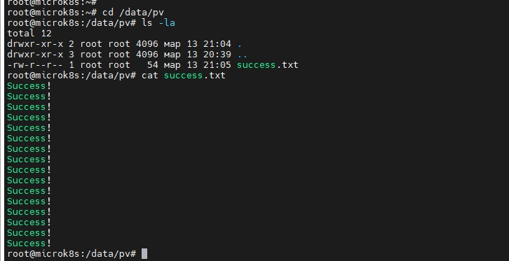
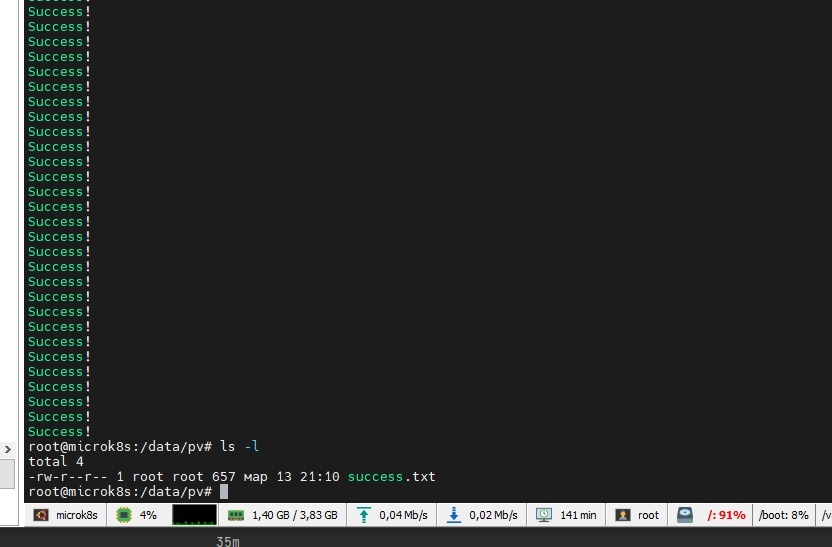
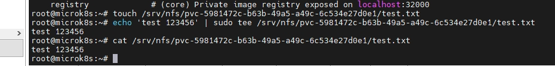

# Домашнее задание к занятию «Хранение в K8s. Часть 2»
Хранение в K8s. Часть 2

### Цель задания

В тестовой среде Kubernetes нужно создать PV и продемонстрировать запись и хранение файлов.

------

### Чеклист готовности к домашнему заданию

1. Установленное K8s-решение (например, MicroK8S).
2. Установленный локальный kubectl.
3. Редактор YAML-файлов с подключенным GitHub-репозиторием.

------

### Дополнительные материалы для выполнения задания

1. [Инструкция по установке NFS в MicroK8S](https://microk8s.io/docs/nfs). 
2. [Описание Persistent Volumes](https://kubernetes.io/docs/concepts/storage/persistent-volumes/). 
3. [Описание динамического провижининга](https://kubernetes.io/docs/concepts/storage/dynamic-provisioning/). 
4. [Описание Multitool](https://github.com/wbitt/Network-MultiTool).

------

### Задание 1

**Что нужно сделать**

Создать Deployment приложения, использующего локальный PV, созданный вручную.

1. Создать Deployment приложения, состоящего из контейнеров busybox и multitool.
2. Создать PV и PVC для подключения папки на локальной ноде, которая будет использована в поде.
3. Продемонстрировать, что multitool может читать файл, в который busybox пишет каждые пять секунд в общей директории. 
4. Продемонстрировать, что файл сохранился на локальном диске ноды, а также что произойдёт с файлом после удаления пода и deployment. Пояснить, почему.
5. Предоставить манифесты, а также скриншоты или вывод необходимых команд.

#### Решение

- [Deployment.yaml](file/deployment.yaml)

```bash
$ kubectl get deployment
NAME             READY   UP-TO-DATE   AVAILABLE   AGE
pvc-deployment   1/1     1            1           17m
$ kubectl get pod
NAME                              READY   STATUS    RESTARTS   AGE
pvc-deployment-67f79c66cd-dzdq7   2/2     Running   0          8m57s
```

- [PV-vol.yaml](file/pv-vol.yaml)

```bash
$ kubectl get pv
NAME   CAPACITY   ACCESS MODES   RECLAIM POLICY   STATUS   CLAIM             STORAGECLASS   REASON   AGE
pv     2Gi        RWO            Retain           Bound    default/pvc-vol                           19m
```

- [PVC-vol.yaml](file/pvc-vol.yaml)

```bash
$ kubectl get pvc
NAME      STATUS   VOLUME   CAPACITY   ACCESS MODES   STORAGECLASS   AGE
pvc-vol   Bound    pv       2Gi        RWO                           19m
```

Заходим на network-multitool проверяем файл success.txt

```bash
$ kubectl exec pvc-deployment-67f79c66cd-dzdq7 -c network-multitool -it -- sh
/ # cat static/success.txt
Success!
Success!
Success!
Success!
```

Проверяем файл на Ноде. Располагается по пути path: /data/pv




Удаляем deployment

```bash
$ kubectl delete deployment pvc-deployment
deployment.apps "pvc-deployment" deleted

$ kubectl get deployment
No resources found in default namespace.
$ kubectl get pod
No resources found in default namespace.
```
pv и pvc остались
```bash
$ kubectl get pvc
NAME      STATUS   VOLUME   CAPACITY   ACCESS MODES   STORAGECLASS   AGE
pvc-vol   Bound    pv       2Gi        RWO                           35m

$ kubectl get pv
NAME   CAPACITY   ACCESS MODES   RECLAIM POLICY   STATUS   CLAIM             STORAGECLASS   REASON   AGE
pv     2Gi        RWO            Retain           Bound    default/pvc-vol                           35m
```

После удаления deployment файлы `pv` остаются на локальной ноде.


- Почему файлы остались после удаления deployment

Ответ: Файлы остались так как никуда не делись `pv и pvc`. Также при конфигурировании `pv` я использовал режим `ReclaimPolicy: Retain` при котором "Retain - после удаления PV ресурсы из внешних
провайдеров автоматически не удаляются". Даже после удаления `pv` файлы также останутся.

------

### Задание 2

**Что нужно сделать**

Создать Deployment приложения, которое может хранить файлы на NFS с динамическим созданием PV.

#### Решение

1. Включить и настроить NFS-сервер на MicroK8S.

- Сделано

2. Создать Deployment приложения состоящего из multitool, и подключить к нему PV, созданный автоматически на сервере NFS.

- [Deployment2.yaml](file/deployment2.yaml)

```bash
$ kubectl apply -f file/deployment2.yaml 
deployment.apps/nfs-deployment created

$ kubectl apply -f file/pvc-vol2.yaml 
persistentvolumeclaim/my-pvc-nfs created

$ kubectl apply -f file/SCl.yaml 
storageclass.storage.k8s.io/my-nfs1 created

$kubectl get pvc
NAME         STATUS   VOLUME                                     CAPACITY   ACCESS MODES   STORAGECLASS   AGE
my-pvc-nfs   Bound    pvc-5981472c-b63b-49a5-a49c-6c534e27d0e1   1Gi        RWO            my-nfs1        42s

$ kubectl get pv
NAME                                       CAPACITY   ACCESS MODES   RECLAIM POLICY   STATUS   CLAIM                STORAGECLASS   REASON   AGE
pvc-5981472c-b63b-49a5-a49c-6c534e27d0e1   1Gi        RWO            Delete           Bound    default/my-pvc-nfs   my-nfs1                 9s
```

```bash
$ kubectl get pod
NAME                              READY   STATUS    RESTARTS   AGE
nfs-deployment-7f64997d46-jrbj5   1/1     Running   0          7m13s

$ kubectl describe  pod nfs-deployment-7f64997d46-jrbj5
Name:         nfs-deployment-7f64997d46-jrbj5
Namespace:    default
Priority:     0
Node:         microk8s/192.168.1.88
Start Time:   Tue, 14 Mar 2023 17:06:10 +0300
Labels:       app=multitool-b
              pod-template-hash=7f64997d46
Annotations:  cni.projectcalico.org/containerID: 53f7e8648a0154edca6a95b6729c8b721b4d48d99d69f7ee03649de0bc347424
              cni.projectcalico.org/podIP: 10.1.128.210/32
              cni.projectcalico.org/podIPs: 10.1.128.210/32
Status:       Running
IP:           10.1.128.210
IPs:
  IP:           10.1.128.210
Controlled By:  ReplicaSet/nfs-deployment-7f64997d46
Containers:
  network-multitool:
    Container ID:   containerd://2dcb58a28e828f9fe520fa006fac5ea6b466849750f6df1b495988dd524eca06
    Image:          wbitt/network-multitool
    Image ID:       docker.io/wbitt/network-multitool@sha256:82a5ea955024390d6b438ce22ccc75c98b481bf00e57c13e9a9cc1458eb92652
    Port:           <none>
    Host Port:      <none>
    State:          Running
      Started:      Tue, 14 Mar 2023 17:10:32 +0300
    Ready:          True
    Restart Count:  0
    Limits:
      cpu:     200m
      memory:  512Mi
    Requests:
      cpu:        100m
      memory:     256Mi
    Environment:  <none>
    Mounts:
      /static from my-vol-pvc (rw)
      /var/run/secrets/kubernetes.io/serviceaccount from kube-api-access-rwq6t (ro)
Conditions:
  Type              Status
  Initialized       True
  Ready             True
  ContainersReady   True
  PodScheduled      True
Volumes:
  my-vol-pvc:
    Type:       PersistentVolumeClaim (a reference to a PersistentVolumeClaim in the same namespace)
    ClaimName:  my-pvc-nfs
    ReadOnly:   false
  kube-api-access-rwq6t:
    Type:                    Projected (a volume that contains injected data from multiple sources)
    TokenExpirationSeconds:  3607
    ConfigMapName:           kube-root-ca.crt
    ConfigMapOptional:       <nil>
    DownwardAPI:             true
QoS Class:                   Burstable
Node-Selectors:              <none>
Tolerations:                 node.kubernetes.io/not-ready:NoExecute op=Exists for 300s
                             node.kubernetes.io/unreachable:NoExecute op=Exists for 300s
Events:
  Type     Reason       Age                  From     Message
  ----     ------       ----                 ----     -------
  Warning  FailedMount  9m54s                kubelet  Unable to attach or mount volumes: unmounted volumes=[my-vol-pvc], unattached volumes=[my-vol-pvc kube-api-access-rwq6t]: timed out waiting for the condition
  Warning  FailedMount  9m49s (x9 over 11m)  kubelet  MountVolume.MountDevice failed for volume "pvc-5981472c-b63b-49a5-a49c-6c534e27d0e1" : kubernetes.io/csi: attacher.MountDevice failed to create newCsiDriverClient: driver name nfs.c
si.k8s.io not found in the list of registered CSI drivers
  Normal   Pulling      7m45s                kubelet  Pulling image "wbitt/network-multitool"
  Normal   Pulled       7m35s                kubelet  Successfully pulled image "wbitt/network-multitool" in 9.947509361s (9.947515362s including waiting)
  Normal   Created      7m35s                kubelet  Created container network-multitool
  Normal   Started      7m35s                kubelet  Started container network-multitool
```

3. Продемонстрировать возможность чтения и записи файла изнутри пода. 

Создаем файл на ноде в директории где автоматически создался `pv`. И потом проверяем доступность внутри пода.



```bash
$ kubectl exec nfs-deployment-7f64997d46-jrbj5 -c network-multitool -it -- sh
/ # cat static/test.txt
test 123456
```

4. Предоставить манифесты, а также скриншоты или вывод необходимых команд.

- [Deployment2.yaml](file/deployment2.yaml)
- [PVC-vol2.yaml](file/pvc-vol2.yaml)
- [SCl.yaml](file/SCl.yaml)

------

### Правила приёма работы

1. Домашняя работа оформляется в своём Git-репозитории в файле README.md. Выполненное задание пришлите ссылкой на .md-файл в вашем репозитории.
2. Файл README.md должен содержать скриншоты вывода необходимых команд `kubectl`, а также скриншоты результатов.
3. Репозиторий должен содержать тексты манифестов или ссылки на них в файле README.md.