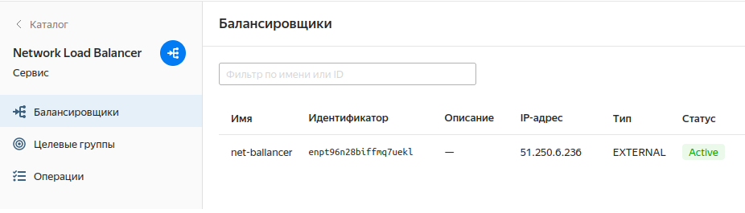

Доработка домашнее задание 

Созднан bucket Object Storage и в нём размещен файл с картинкой

Создана группа ВМ в public подсети которая подключена к сетевому балансировщику

Проверка балансировщика  и отключаем одну ВМ

